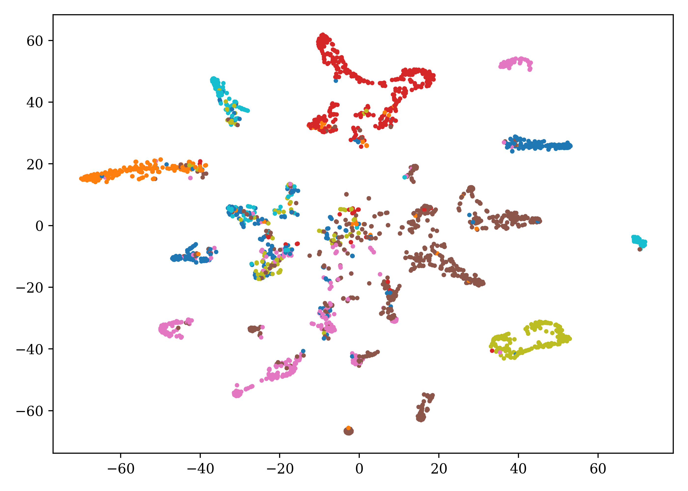
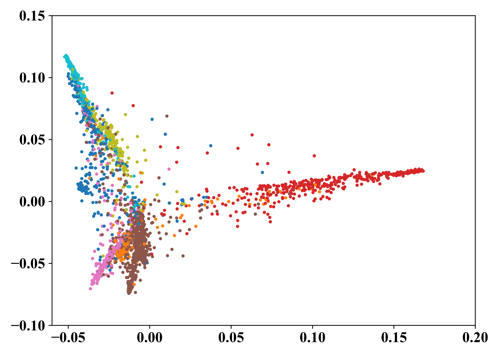

# ERASE: Error-Resilient Representation Learning on Graphs for Label Noise Tolerance
Official code for "ERASE: Error-Resilient Representation Learning on Graphs for Label Noise Tolerance". 


[Ling-Hao Chen](https://lhchen.top/)<sup>1,2</sup>, Yuanshuo Zhang<sup>2,3</sup>, Taohua Huang<sup>3</sup>, [Liangcai Su](https://liangcaisu.github.io/)<sup>1</sup>, Zeyi Lin<sup>2,3</sup>, Xi Xiao<sup>1</sup>, [Xiaobo Xia](https://xiaoboxia.github.io/)<sup>4</sup>, [Tongliang Liu](https://tongliang-liu.github.io/)<sup>4</sup>

<sup>1</sup>Tsinghua University, <sup>2</sup>SwanHub.co, <sup>3</sup>Xidian University, <sup>4</sup>The University of Sydney

<p align="center">
  <a href='https://arxiv.org/abs/2312.08852'>
  
  </a> 
  <a href='https://arxiv.org/pdf/2312.08852.pdf'>
  
  </a> 
  <a href='https://eraseai.github.io/ERASE-page'>
  </a> 
  <a href='https://youtu.be/w5HwGb8bElA'>
  </a> 
  <a href='https://github.com/eraseai/erase'>
  </a> 
  <a href='LICENSE'>
  
  </a> 
  <a href="" target='_blank'>
  
  </a> 
</p>

<p align="center">
    
</p>


## 📖 Abstract

Deep learning has achieved remarkable success in graph-related tasks, yet this accomplishment heavily relies on large-scale high-quality annotated datasets. However, acquiring such datasets can be cost-prohibitive, leading to the practical use of labels obtained from economically efficient sources such as web searches and user tags. Unfortunately, these labels often come with noise, compromising the generalization performance of deep networks.
To tackle  this challenge and enhance the robustness of deep learning models against label noise in graph-based tasks, we propose a method called ERASE (Error-Resilient representation learning on graphs for lAbel noiSe tolerancE). The core idea of ERASE is to learn representations with error tolerance by maximizing coding rate reduction. Particularly, we introduce a decoupled label propagation method for learning representations. Before training, noisy labels are pre-corrected through structural denoising. During training, ERASE combines prototype pseudo-labels with propagated denoised labels and updates representations with error resilience, which significantly improves the generalization performance in node classification. The proposed method allows us to more effectively withstand errors caused by mislabeled nodes, thereby strengthening the robustness of deep networks in handling noisy graph data. Extensive experimental results show that our method can outperform multiple baselines with clear margins in broad noise levels and enjoy great scalability. Codes are released at https://github.com/eraseai/erase. 

## 🗂️ Preparation
### 📊 Data
Datasets for Cora, CiteSeer, PubMed, CoraFull, and [OGBn-arxiv](https://ogb.stanford.edu/docs/nodeprop/#ogbn-arxiv) are integrated in [PyG](https://pytorch-geometric.readthedocs.io/en/latest/modules/datasets.html#torch_geometric.datasets.Planetoid). The datasets will be downloaded by the codes automatically. And your `./data` directory structure is shown as follows after running [training codes](https://github.com/eraseai/erase?tab=readme-ov-file#-training).

```
data
├──Planetoid
|   ├── Cora
|   |   ├── processed
|   |   |   ├── data.pt
|   |   |   ├── pre_filter.pt
|   |   |   └── pre_transform.pt
|   |   └── raw
|   ├── CiteSeer
|   |   ├── processed
|   |   |   ├── data.pt
|   |   |   ├── pre_filter.pt
|   |   |   └── pre_transform.pt
|   |   └── raw
|   └── PubMed
|       ├── processed
|       |   ├── data.pt
|       |   ├── pre_filter.pt
|       |   └── pre_transform.pt
|       └── raw
├── CitationFull
|   └── cora
|       ├── processed
|       |   ├── data.pt
|       |   ├── pre_filter.pt
|       |   └── pre_transform.pt
|       └── raw
└── Ogb
    └── ogbn-arxiv
        ├── mapping
        ├── processed
        |   ├── geometric_data_processed.pt
        |   ├── pre_filter.pt
        |   └── pre_transform.pt
        ├── raw
        └── split
```
### 🕹️ Environment Setup

```
sh install.sh
```

## 🔧 Training

For Cora:

```
chmod +x run.sh
sh run.sh Cora
```

For CiteSeer:

```
chmod +x run.sh
sh run.sh CiteSeer
```

For PubMed 

```
chmod +x run.sh
sh run.sh PubMed
```
For CoraFull
```
chmod +x run.sh
sh run.sh CoraFull
```

For OGBn-arxiv
```
chmod +x run.sh
sh run.sh ogbn-arxiv
```

After running the command, a directory named `<DATASET>_<INDEX> ` is created in the `./exp_output` directory (`<DATASET>` in `{'Cora', 'CiteSeer', 'PubMed', 'CoraFull', 'ogbn-arxiv'}`, `<INDEX>` is equal to the number of directories in `./exp_output`). In `./exp_output/<DATASET>_<INDEX>/asymm_noise_ratio_0.1` stores the results of 0.1 asymmetric noise ratio. In this directory, log files are stored in `train_log.txt`, and model checkpoints are stored in `ckpt`.

## 📽 Visualization 

Before getting visualization results, please ensure that you have saved the pre-trained models. Hereby we show the example to get visualization results on Cora when the asymmetric noise ratio is 0.1.
```
python scripts/visualize.py --dataset Cora --resume exp_output/Cora/asymm_noise_ratio_0.1/ckpt/best_model.pth -- corrupt_type asymm --corrupt_ratio 0.1
```


### 🧐 Example of Visualization Results 
Cosine Similarity Matrix Visualization
<p align="center">
    
</p>
t-SNE Visualization
<p align="center">
    
</p>
PCA Visualization
<p align="center">
    
</p>

## 📄 License

The codes are distributed under a non-commercial [LICENSE](https://github.com/eraseai/erase/blob/master/LICENSE). Note that our code depends on other libraries and datasets which each have their own respective licenses that must also be followed. For commercial usage, please contact [Ling-Hao Chen](https://lhchen.top).

## 🌹 Acknowledgments

The author team would sincerely acknowledge [MCR<sup>2</sup> authors](https://github.com/ryanchankh/mcr2/blob/master) and [G<sup>2</sup>R authors](https://github.com/ahxt/G2R) for providing significant reference and codebase. Portions of this code were adapted from these open-source projects.

## 🤝 Citation

If you find the code is useful in your research, please cite us:
```bash
@article{chen2023erase,
title={ERASE: Error-Resilient Representation Learning on Graphs for Label Noise Tolerance},
author={Chen, Ling-Hao and Zhang, Yuanshuo and Huang, Taohua and Su, Liangcai and Lin, Zeyi and Xiao, Xi and Xia, Xiaobo and Liu, Tongliang},
journal={Arxiv 2312.08852},
year={2023}
}
```

## 🌟 Star History

<p align="center">
    <a href="https://star-history.com/#eraseai/erase&Date" target="_blank">
        
    </a>
<p>

If you have any questions, please contact thu [DOT] lhchen [AT] gmail [DOT] com.

